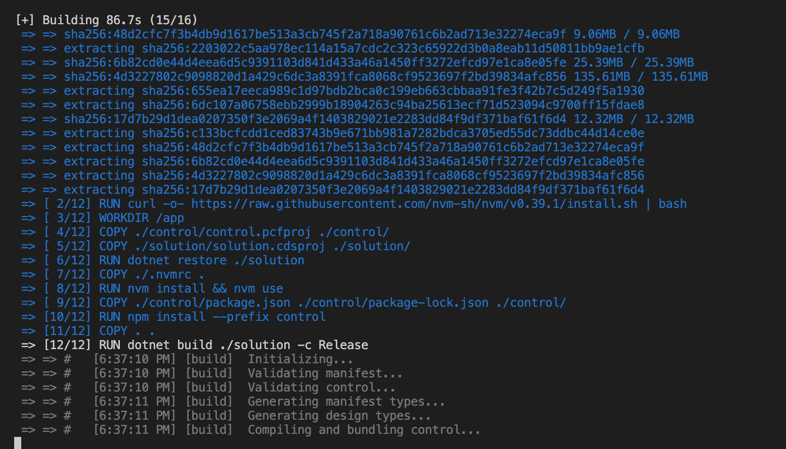

# Sample - PCF Docker build

Repo containing a basic PCF control/solution that can be built using a Docker container.

## How to build in docker?
Prerequisites:
- Docker installed / configured, and is currently running
- Mac/Linux: 
  - Ability to run sh scripts

Steps:
1. Clone the repo
2. Open the root folder of the repo in a terminal
3. Run `./build_docker.sh`

Notes:
- Initial build will be slow, it is setting things up
   
- Subsequent builds will be faster thanks to docker caching
   

## How to build locally?
Prerequisites:
- Dotnet 6 installed
- NodeJS (and NPM) installed
- Mac/Linux: 
  - Ability to run sh scripts

Steps:
1. Clone the repo
2. Open the root folder of the repo in a terminal
3. Run `./build_local.sh`

## How to get the solution file
- Build the solution using one of the options above
- Open the `./dist` folder, the solution will be in there
  
